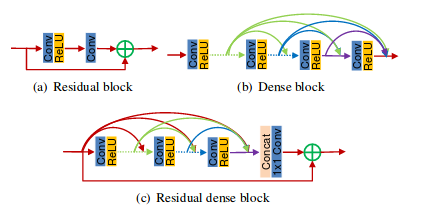
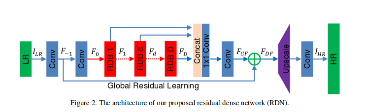
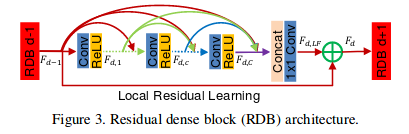
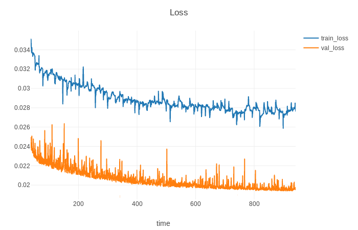

# RDN
This project aims at providing a fast, modular reference implementation for super-resolution  models using pytorch 

## Introducation 
- [RDN](https://arxiv.org/abs/1802.08797)  
               

               

## training  
### preprocess
For training you shall download the DIV2k dataset:- [DIV2K]https://data.vision.ee.ethz.ch/cvl/DIV2K/   
put your train_img,and valid_img to the DIV2K_train_HR and DIV2K_valid_HR.   
1. you shall python main.py process to generate downsample data and then you can train your RDN-Net to use python main.py train . 
2. you can change your para from the config.py All of it realized from pytorch. 
Finaly if you want to see the output ,you can download the visdom to see output real time

### training_Loss 
 

## eval
### eval_result
  

## Support
Finaly if you want to see the output ,you can download the visdom to see output real time
if you have question ,email me 1259738366@qq.com
